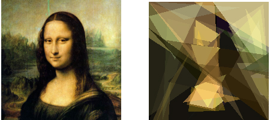

# Genetic Painter: a genetic algorithm evolving pictures

Straight-forward C implementation of a genetic algorithm with crossover and
mutation, using OpenGL to render each individual as an overlap of triangles.

The main goal of this project was to experiment with different parameters and
find a good way to encode pictures into DNA strings, therefore the performance
is not optimal (no multi-threading), but still decent.

### Usage

Compile with `gcc -o genetic_painter genetic_painter.c -lGL -lGLEW -lglut -lglfw -lm -O3` and simply run it as `./genetic_painter `.

You may want to change the hyperparameters defined in the source to your liking, however I found them to be quite optimal for this specific cost function (mona-200.png).
